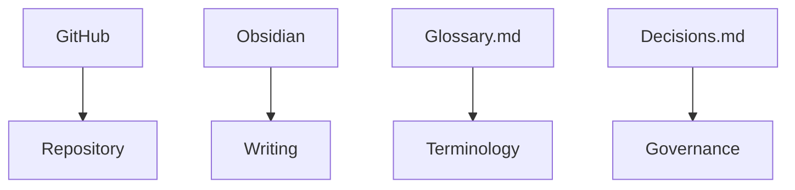

# Tooling Discussion

Status: Draft
Session duration: 15 minutes

## Tool Map

## Today's Goal

The goal is making sure everyone can:

- Access the repository.
- Open the vault in Obsidian.
- Edit a file.
- Commit changes.

## Minimum Tooling Readiness

| Capability | Owner | Status | Notes |
|---|---|---|---|
| Repository access | TBD | Pending | Confirm all volunteers can access GitHub. |
| Obsidian installed/opened | TBD | Pending | Confirm vault opens correctly. |
| File edit completed | TBD | Pending | Each volunteer edits a test note. |
| Commit completed | TBD | Pending | Each volunteer completes one commit. |
