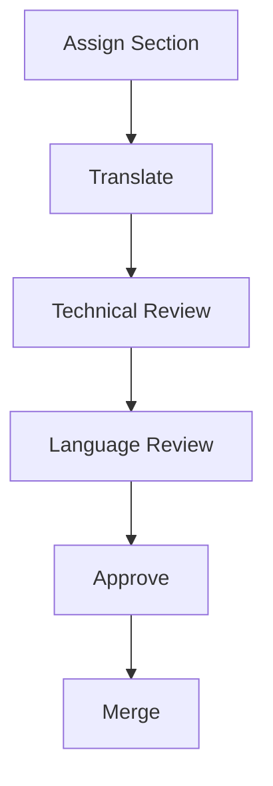

# Translation Workflow v0.1

Status: For WG approval
Date proposed: 07.06.2026

## Workflow

## Steps

| Step | Owner | Output |
|---|---|---|
| Assign Section | WG lead | Section has translator, reviewer, due date. |
| Translate | Translator | Arabic draft using approved glossary. |
| Technical Review | SE Reviewer | Meaning and SE correctness checked. |
| Language Review | Reviewer | Arabic language and style checked. |
| Approve | WG lead or assigned approver | Section approved for merge. |
| Merge | Repository maintainer | Approved text merged into main vault/repository. |

## Rule

Terminology disagreements are not resolved inside the translation text. They are recorded in the decision log and resolved through the glossary process.
