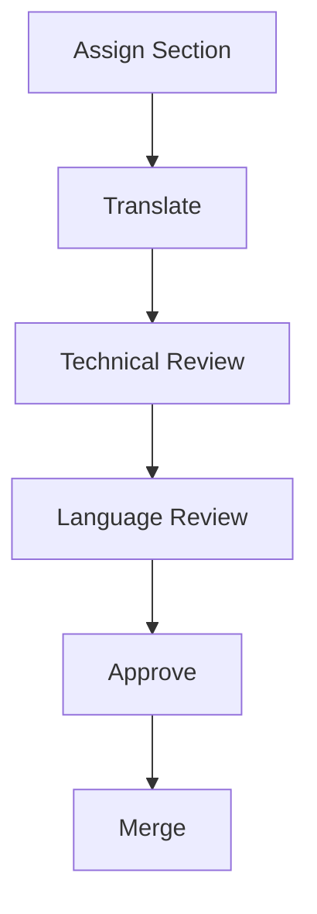

# 2026-06-07 2nd Session

## Purpose

Establish the minimum governance, glossary, workflow, and assignments needed to begin the INCOSE handbook Arabic translation work.

## Agenda

1. Present Translation Principles v0.1 for approval.
2. Create and approve Glossary v0.1 with 20-30 terms.
3. Establish roles.
4. Create and explain the Decision Log.
5. Walk through one real paragraph from today's chapter.
6. Introduce the translation workflow.
7. Discuss the Arabic Style Guide.
8. Confirm basic tooling readiness.
9. Assign next sections.

## Translation Principles for Approval

See [[Translation-Principles-v0.1]].

## Glossary

See [[INCOSE-MENA-Arabic-Glossary]].

Session goal: 20-30 approved terms today.

## Roles

See [[Roles-and-Responsibilities]].

Roles to assign:

- Translators
- Reviewers
- SE Reviewers
- Glossary Curator

## Decision Log

See [[Decisions]].

First decision to confirm:

| ID | English | Arabic | Status |
|---|---|---|---|
| DEC-001 | Verification | التحقق | Proposed |

## Real Example Walkthrough

Use a paragraph from today's chapter.

| Step | Activity | Output |
|---|---|---|
| 1 | Read English. | Shared understanding of source paragraph. |
| 2 | Identify terms. | Candidate glossary terms listed. |
| 3 | Check glossary. | Approved Arabic terms selected. |
| 4 | Translate. | Arabic draft paragraph. |
| 5 | Review. | Technical and language comments. |
| 6 | Approve. | Final Arabic paragraph ready to merge. |

## Workflow

See [[Translation-Workflow-v0.1]].

## Arabic Style Guide

See [[Arabic-Style-Guide-v0.1]].

Questions for decision:

| Question | Recommendation | Decision |
|---|---|---|
| Formal Arabic only? | Yes | Pending |
| English term in brackets on first occurrence? | Yes | Pending |
| Keep acronyms in English? | Yes | Pending |

## Tooling Discussion

See [[Tooling-Discussion]].

Confirm everyone can:

- Access repository.
- Open Obsidian.
- Edit a file.
- Commit changes.

## Deliverables By End Of Session

- [ ] Glossary v0.1 with 20-30 approved terms.
- [ ] Translation Principles v0.1 approved.
- [ ] Decision Log created.
- [ ] Roles assigned.
- [ ] Workflow approved.
- [ ] One section translated together.
- [ ] Next section assignments created.

## Assignment for Next Session

| Volunteer | Assignment | Due Date | Reviewer | Notes |
|---|---|---|---|---|
| Ahmed | Section 1.1 | TBD | TBD | Example assignment. |
| Fatima | Section 1.2 | TBD | TBD | Example assignment. |
| Omar | Glossary maintenance | TBD | WG lead | Example assignment. |

## Open Questions

- Which chapter paragraph will be used for the live walkthrough?
- Who is the glossary curator?
- What is the next meeting date?
